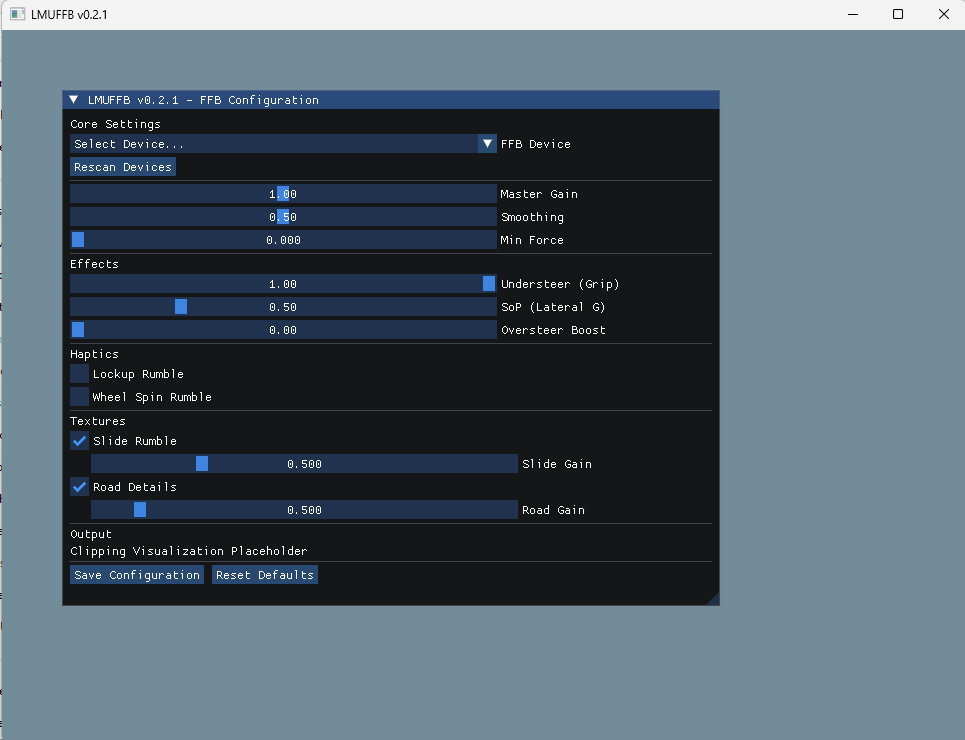

# LMU Force Feedback App (C++ Version)

This is the main C++ implementation of the LMU Force Feedback App, designed for high performance and low latency.

## Features

*   **High Performance Core**: Native C++ Multi-threaded architecture.
    *   **FFB Loop**: Runs at ~400Hz to match game physics.
    *   **GUI Loop**: Runs at ~60Hz with lazy rendering to save CPU.
*   **Real-time Tuning GUI**:
    *   Built with **Dear ImGui** for responsive adjustment of parameters.
    *   Sliders for Master Gain, Understeer (Grip Loss), SoP (Seat of Pants), and Min Force.
    *   Toggles for Texture effects (Slide Rumble, Road Details).
*   **Custom Effects**:
    *   **Grip Modulation**: Feel the wheel lighten as front tires lose grip.
    *   **Texture Synthesis**: Synthetic road noise and slide vibration injection.
*   **Easy Installation**: Inno Setup installer script included to manage dependencies (vJoy, Plugins).

## Screenshot



## Architecture

The application reads telemetry from the rFactor 2 engine (Le Mans Ultimate) via Shared Memory and calculates a synthetic Force Feedback signal to send to a vJoy device.

### Prerequisites

*   **vJoy**: Must be installed and configured.
*   **rFactor 2 Shared Memory Map Plugin**: Must be installed in `Le Mans Ultimate/Plugins` and enabled.

## Building

### Prerequisites for all methods
*   **Compiler**: MSVC (Visual Studio 2022 Build Tools) or generic C++ compiler.
*   **Build System**: CMake (3.10+).
*   **vJoy**:
    *   **Users**: Install the **vJoy Driver**. We recommend version **2.1.9.1** (by jshafer817) for Windows 10/11 compatibility. See [vJoy Compatibility Guide](docs/vjoy_compatibility.md) for download links and details.
    *   **Developers**: The vJoy Installer typically installs the **SDK** (headers and libraries) to `C:\Program Files\vJoy\SDK`. LMUFFB links against this SDK.
*   **Dear ImGui (Optional)**: Download from [GitHub](https://github.com/ocornut/imgui) and place in `vendor/imgui` to enable the GUI.

### Option A: Visual Studio 2022 (IDE)
1.  Open Visual Studio.
2.  Select "Open a local folder" and choose the repo root.
3.  Visual Studio will auto-detect `CMakeLists.txt`.
4.  Open `CMakeSettings.json` (or Project Settings) to verify the variable `VJOY_SDK_DIR` points to your vJoy SDK location (Default: `C:/Program Files/vJoy/SDK`).
5.  Select **Build > Build All**.

### Option B: Visual Studio Code
1.  Install **VS Code**.
2.  Install extensions: **C/C++** (Microsoft) and **CMake Tools** (Microsoft).
3.  Open the repo folder in VS Code.
4.  When prompted to configure CMake, select your installed compiler kit (e.g., *Visual Studio Community 2022 Release - x86_amd64*).
5.  Open `.vscode/settings.json` (or create it) to set the vJoy path:
    ```json
    {
        "cmake.configureSettings": {
            "VJOY_SDK_DIR": "C:/Path/To/vJoy/SDK"
        }
    }
    ```
6.  Click **Build** in the bottom status bar.

### Option C: Command Line (Windows)
1.  Open the **Developer Command Prompt for VS 2022**.
2.  Navigate to the repository root.
3.  Run the following commands:
    ```cmd
    mkdir build
    cd build
    cmake -G "NMake Makefiles" -DVJOY_SDK_DIR="C:/Path/To/vJoy/SDK" ..
    nmake
    ```
    *Alternatively, use `cmake --build .` instead of `nmake`.*

## Documentation

*   [FFB Customization Guide](docs/ffb_customization.md)
*   [GUI Framework Options](docs/gui_framework_options.md)
*   [DirectInput Implementation Guide](docs/directinput_implementation.md)
*   [vJoy Compatibility Guide](docs/vjoy_compatibility.md)
*   [Licensing & Redistribution](docs/licensing.md)
*   [Python Prototype & Porting Guides](docs/python_version/)

## Installation (End Users)

### Prerequisites
*   **vJoy Driver**: Install version **2.1.9.1** (by jshafer817) or compatible. Download from [vJoy releases](https://github.com/jshafer817/vJoy/releases) or the [vJoy Compatibility Guide](docs/vjoy_compatibility.md).
*   **rFactor 2 / Le Mans Ultimate**: The game must be installed.
*   **rF2 Shared Memory Plugin**: Download and install from [the plugin repository](https://github.com/dallasformula/rF2SharedMemoryMapPlugin) into your `Le Mans Ultimate/Plugins` folder.

### Running LMUFFB

1.  **Download** the latest release of `LMUFFB.exe` from the [Releases](../../releases) page.
2.  **Extract** the archive to your desired location.
3.  **Important**: Ensure `vJoyInterface.dll` is in the same folder as `LMUFFB.exe`. 
    - If the build process copied it automatically, it should already be there.
    - If not, manually copy `vJoyInterface.dll` from `C:\Program Files\vJoy\SDK\lib\amd64\` (for 64-bit) or `C:\Program Files\vJoy\SDK\lib\` (for 32-bit) to the folder containing `LMUFFB.exe`.
    - Alternatively, ensure `vJoyInterface.dll` is in a system PATH directory (e.g., `System32`).
4.  **Start rFactor 2 / Le Mans Ultimate** and load a race.
5.  **Run `LMUFFB.exe`**. A GUI window should appear with tuning sliders.
6.  **Configure your wheel** in the GUI and enjoy force feedback!

### Troubleshooting

- **"vJoyInterface.dll not found"**: Ensure the DLL is in the same folder as the executable or in your system PATH.
- **"Could not open file mapping object"**: This is normal if the game isn't running. Start rFactor 2 / Le Mans Ultimate first.
- **No force feedback**: Check that vJoy is installed and the rF2 Shared Memory Plugin is enabled in the game.

