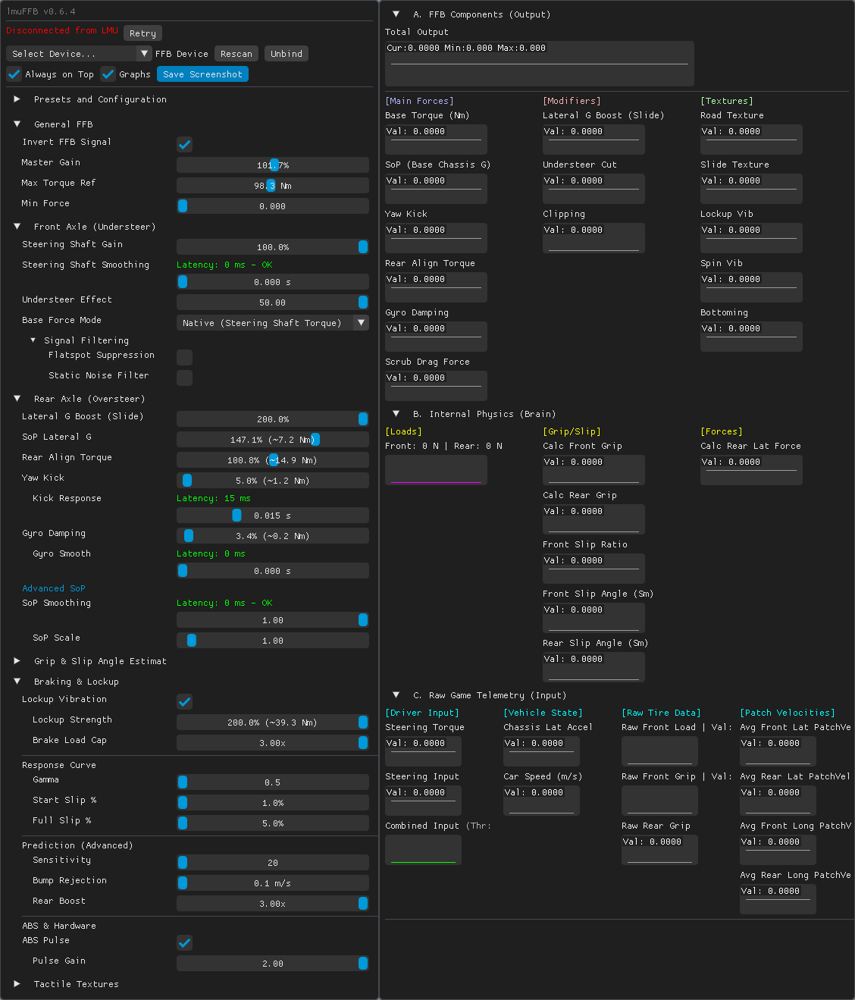

# lmuFFB

A FFB app for LMU, similar to irFFB and Marvin's iRacing App

Experimental alpha version.



## 📥 Download

**[Download the latest release from GitHub](https://github.com/coasting-nc/LMUFFB/releases)**


## Installation & Configuration (LMU 1.2+)


### Step-by-Step Setup

**B. Configure lmuFFB**
1.  Run `LMUFFB.exe`.
2.  **FFB Device**: In the dropdown, select your **Physical Wheel** (e.g., "Simucube 2 Pro", "Fanatec DD1").
3.  **Master Gain**: Start low (0.5) and increase.

**A. Configure Le Mans Ultimate (LMU)**
1.  Start LMU.
2.  Go to **Settings > Graphics**:
    *   Set **Display Mode** to **Borderless**. (Prevents crashes/minimizing).
3.  Go to **Controls > Force Feedback**.
4.  **Steering Axis**: Bind to your **Physical Wheel** (e.g., Simucube, Fanatec, Moza, Logitech).
5.  **In-Game Force Feedback settings in LMU**:
    *   **Disable FFB** Set FFB Effects **Off**.
    *   **FFB Strength**: reduce to **0%**.

4.  **Drive!** You should feel force feedback generated by the app.

## 🧪 Experimental Version - Testing Needed!

This is an **experimental release**, the FFB formulas may require refinement based on real-world testing.

**Please help us improve lmuFFB:**
1. **Test with caution** - Start with low wheel strength settings
2. **Experiment with settings** - Try different effect combinations and gains
3. **Share your results** - Post screenshots (including the lmuFFB console and the "Graphs" window) to the [LMU Forum Thread for the lmuFFB App](https://community.lemansultimate.com/index.php?threads/lmuffb-app.10440/)
4. **Report issues** - Let us know what works and what doesn't!

Your testing and feedback is greatly appreciated! 🙏


### Troubleshooting

-   **Inverted FFB (Force pushes away from center)**:
    -   If the FFB feels "backwards" or "inverted" while driving (wheel pushes away from center instead of pulling toward it), check the **"Invert FFB"** checkbox in the lmuFFB GUI.
    -   This reverses the force direction to match your wheel's expected behavior.
-   **No FFB**: 
    - Ensure the "FFB Device" in lmuFFB is your real wheel
    - Check if Connected to Le Mans Ultimate" appear in the GUI
    - Verify the FFB strength in your device driver is not too low
    - Increase Master Gain or reduce Max Torque Ref
    - Check the lmuFFB console for errors
-   **Baseline vibration from the FFB**:
    -   That is known to come from the Steering Shaft Torque from the game (you can temporarily disable Steering Shaft Gain to confirm it).
    -   To fix it, enable the **"Static Noise Filter"** in lmuFFB and set a **Target Frequency** of **10-12 Hz**.
    -   If some noise is still present, you can increase the **Steering Shaft Smoothing**.
-   **Steering wheel bouncing/shaking when stationary (engine vibration)**:
    -   If your wheel "bounces around on the tune of the engine rpm" when the car is stopped or idling, this is caused by the game's engine vibration physics being transmitted through the steering column.
    -   **Automatic Fix (v0.6.22+)**: This is now automatically handled by the Automatic Idle Smoothing feature. The vibration should fade out when you're stationary and return to normal when driving.
    -   **Manual Workaround (older versions)**: Go to **Signal Filtering**, enable **Static Noise Filter**, and set the frequency to **10-15 Hz**. Adjust until the bouncing stops. This will surgically remove the engine bounce without making the steering feel light.
-   **FFB too weak**:
    -   Increase **Master Gain**.
    -   Or reduce **Max Torque Ref** (this amplifies the signal by setting a lower reference point for maximum torque).
-   **Violent oscillations or shaking**:
    -   If you experience violent oscillations that the Smoothing or Speed Gate settings don't catch, try **increasing Max Torque Ref** (e.g., from 45 to 60-80 Nm).
    -   Higher Max Torque Ref values reduce clipping and noise, which can cause oscillations.
    -   **Tuning Tip**: Max Torque Ref is the primary way to control the balance between clipping/noise and steering weight. Start at 45 Nm and adjust based on your preference.
-   **Strange pull in some scenarios**:
    -   If you feel a strange pull in specific driving situations, try reducing the **Rear Align Torque**.
-   **The app has too many options and it's confusing**:
    -   A future version will include a **"Basic Mode"** with auto adjustment and defaults for most settings.
    -   We need to first determine which settings work best for most users and wheel types (Direct Drive vs Belt/Gear).
    -   **Please leave feedback** on the forum thread telling us what settings work best for you: [LMU Forum Thread](https://community.lemansultimate.com/index.php?threads/lmuffb-app.10440/)
-   **Any other issue**:
    -   Report it in the [LMU Forum Thread](https://community.lemansultimate.com/index.php?threads/lmuffb-app.10440/) to get support and help us update the app.
    -   **Important**: You can help significantly by taking a screenshot (use the "**Save Screenshot**" button in the app) and pasting it into your forum post. This captures all your settings and the console log in one go.


### Upcoming Features

* Basic mode with only main sliders and auto adjustment of other settings
* Adaptive Optimal Slip Angle
* Wet Weather Haptics (Hydro-Grain): vibration cues telling when the tires are on dry or wet surface, and if there is grip or not 
* Per wheel Hydro-Grain to give information about a drying racing line (e.g., left tires on dry, right tires on wet)  
* Longitudinal Dynamic Weight Transfer:  feeling of the car getting heavy under braking and light under acceleration.

  
## Feedback & Support

For feedback, questions, or support:
*   **LMU Forum Thread**: [lmuFFB App](https://community.lemansultimate.com/index.php?threads/lmuffb-app.10440/)
*   **GitHub Issues**: [Report bugs or request features](https://github.com/coasting-nc/LMUFFB/issues)


## Documentation

*   [FFB Tuning Recommendations](docs/FFB%20Tuning%20Recommendations.md) 
*   [Driver's Guide to Testing LMUFFB](docs/Driver's%20Guide%20to%20Testing%20LMUFFB.md) - Suggestions for specific driving scenarios and car setups to test each FFB effect 
*   [The Physics of Feel - Driver's Guide](docs/the_physics_of__feel_-_driver_guide.md) - Explains how lmuFFB translates telemetry into tactile sensations, with telemetry visualizations
*   [FFB Effects & Customization Guide](docs/ffb_effects.md)
*   [Telemetry Data Reference](docs/dev_docs/telemetry_data_reference.md)
*   [FFB Math Formulas](docs/dev_docs/FFB_formulas.md)
*   [How to Contribute to the Project](docs/dev_docs/contribute_to_the_project/how_to_contribute_to_the_project.md) - Step-by-step guide for contributors using AI-assisted coding tools


## Features

*   **Custom Effects**:
    *   **Grip Modulation**: Feel the wheel lighten as front tires lose grip.
    *   **Dynamic Oversteer**: Counter-steering force suggestion based on rear axle alignment torque (v0.2.2).
    *   **Progressive Lockup**: Feel the edge of tire braking limit before full lock (v0.2.2).
    *   **Traction Loss**: Feel the rear "float" and spin up under power (v0.2.2).


## Building (for developers)

### Prerequisites (First Setup)

1.  **Compiler**: MSVC (Visual Studio 2022 Build Tools) or generic C++ compiler.
2.  **Build System**: CMake (3.10+).

**One-time Setup Steps (PowerShell):**

```powershell
# Enable execution of scripts
Set-ExecutionPolicy -ExecutionPolicy RemoteSigned -Scope CurrentUser

# Initialize build files
& 'C:\Program Files\Microsoft Visual Studio\2022\Community\Common7\Tools\Launch-VsDevShell.ps1' -Arch amd64 -SkipAutomaticLocation; cmake -B build

# Download and Install ImGui (Required for GUI)
New-Item -ItemType Directory -Path "vendor\imgui" -Force
Invoke-WebRequest -Uri "https://github.com/ocornut/imgui/archive/refs/heads/master.zip" -OutFile "vendor\imgui-master.zip"
Expand-Archive -Path "vendor\imgui-master.zip" -DestinationPath "vendor" -Force
Copy-Item -Path "vendor\imgui-master\*" -Destination "vendor\imgui\" -Recurse -Force
Test-Path "vendor\imgui\imgui.cpp"
Remove-Item -Path "vendor\imgui-master.zip", "vendor\imgui-master" -Recurse -Force
```

### Build & Test

**Option 1: Build EVERYTHING (App + Tests) in one command:**
This will compile the main application, compile all test suites, and report build status.
```powershell
& 'C:\Program Files\Microsoft Visual Studio\2022\Community\Common7\Tools\Launch-VsDevShell.ps1' -Arch amd64 -SkipAutomaticLocation; cmake -S . -B build; cmake --build build --config Release --clean-first
```

**Option 2: Run All Tests:**
After building, run the unified test runner to verify everything (Physics, Windows Platform, Screenshots):
```powershell
.\build\tests\Release\run_combined_tests.exe
```


### rFactor 2 Compatibility

**Note**: rFactor 2 is **not supported** in v0.4.0+. For rFactor 2, please use earlier versions of lmuFFB (v0.3.x). See the [releases page](https://github.com/coasting-nc/LMUFFB/releases) for v0.3.x downloads.
rF2 will be supported again in a future version, in particular to compare our grip approximation alghorithm with the real values returned by the game for non DLC cars.
