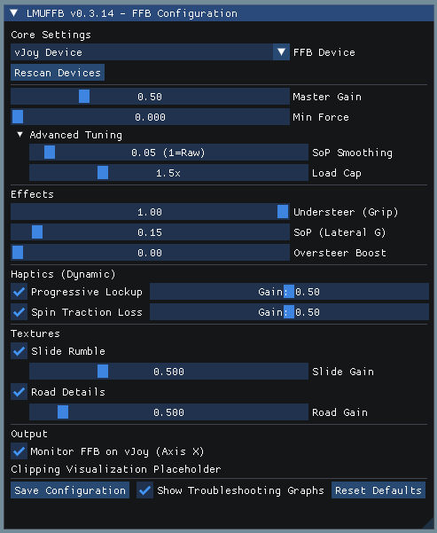

# lmuFFB

A FFB app for LMU, similar to irFFB and Marvin's iRacing App

Experimental alpha version.





## ⚠️ CRITICAL SAFETY WARNING ⚠️

**BEFORE USING THIS APPLICATION, YOU MUST CONFIGURE YOUR STEERING WHEEL DEVICE DRIVER:**

This is an **experimental early alpha version** of a force feedback application. The FFB formulas are still being refined and **may produce strong force spikes and oscillations** that could be dangerous or damage your equipment. 
**BEFORE running LMU and lmuFFB**, open your wheelbase/steering wheel device driver configurator (e.g., Simucube TrueDrive, Fanatec Control Panel, Moza Pit House, etc.) and **Reduce the Maximum FFB Strength/Torque to a LOW value:**
   - **For Direct Drive Wheelbases**: Set to **10% or lower** of maximum torque
   - **For Belt/Gear-Driven Wheels**: Set to **20-30%** of maximum strength
Increase gradualy the values while monitoring for unexpected behavior.

## 📥 Download

**[Download the latest release from GitHub](https://github.com/coasting-nc/LMUFFB/releases)**


## Installation & Configuration (LMU 1.2+)

### Step-by-Step Setup

**⚠️ STEP 0: Reduce Wheel Strength FIRST (CRITICAL)**
1.  **BEFORE doing anything else**, open your wheel device driver (Simucube TrueDrive, Fanatec Control Panel, Moza Pit House, etc.)
2.  **Reduce Maximum FFB Strength/Torque**:
    *   Direct Drive Wheels: Set to **10% or lower**
    *   Belt/Gear Wheels: Set to **20-30%**
3.  **Save the settings** and keep the driver software open for adjustments

**A. Configure Le Mans Ultimate (LMU)**
1.  Start LMU.
2.  Go to **Settings > Graphics**:
    *   Set **Display Mode** to **Borderless**. (Prevents crashes/minimizing).
3.  Go to **Controls / Bindings**.
4.  **Steering Axis**: Bind to your **Physical Wheel** (e.g., Simucube, Fanatec, Moza, Logitech).
5.  **In-Game Force Feedback settings in LMU**:
    *   **FFB Strength**: reduce to **0%** (Off).
    *   **Effects**: Set "Force Feedback Effects" to **Off**.
    *   **Smoothing**: Set to **0** (Raw).
    *   **Advanced**: Set "Collision Strength" and "Steering Torque Sensitivity" to **0%**.
    *   **Tweaks**: Disable "Use Constant Steering Force Effect".

**B. Configure lmuFFB**
1.  Run `LMUFFB.exe`.
2.  **FFB Device**: In the dropdown, select your **Physical Wheel** (e.g., "Simucube 2 Pro", "Fanatec DD1").
3.  **Master Gain**: Start low (0.5) and increase.
4.  **Drive!** You should feel force feedback generated by the app.

## 🧪 Experimental Version - Testing Needed!

This is an **experimental release** with the new LMU 1.2 interface. The FFB formulas may require refinement based on real-world testing.

**Please help us improve lmuFFB:**
1. **Test with caution** - Start with low wheel strength settings (see Safety Warning above)
2. **Experiment with settings** - Try different effect combinations and gains
3. **Share your results** - Post screenshots of the "Troubleshooting Graphs" window and the main app window to the [LMU Forum Thread](https://community.lemansultimate.com/index.php?threads/irffb-for-lmu-lmuffb.10440/)
4. **Report issues** - Let us know what works and what doesn't!

Your testing and feedback is greatly appreciated! 🙏


### Troubleshooting

- **Wheel Jerking / Fighting**: You likely have a "Double FFB" conflict.
    - Ensure in-game FFB Strength is set to **0%** (Off).
    - If the wheel oscillates on straights, reduce **SOP Effect** to 0.0 and increase smoothing.
-   **Inverted FFB (Force pushes away from center)**:
    -   If the FFB feels "backwards" or "inverted" while driving (wheel pushes away from center instead of pulling toward it), check the **"Invert FFB"** checkbox in the lmuFFB GUI.
    -   This reverses the force direction to match your wheel's expected behavior.
-   **FFB Too Strong / Dangerous Forces**:
    -   **IMMEDIATELY** reduce the maximum FFB strength in your wheel device driver (Simucube TrueDrive, Fanatec Control Panel, Moza Pit House, etc.).
    -   Set to **10% or lower** for direct drive wheels, **20-30%** for belt/gear wheels.
    -   Do this **before** running LMU and lmuFFB again.
    -   Then adjust the "Gain" slider in lmuFFB to fine-tune.
-   **No FFB**: 
    -   Ensure the "FFB Device" in lmuFFB is your real wheel.
    -   Check if the Shared Memory is working (Does "Connected to Le Mans Ultimate" appear in the GUI?).
    -   Verify you're running LMU 1.2 or later (earlier versions don't have native shared memory).
-   **Device Unavailable**: 
    -   If you see `[DI Warning] Device unavailable` in the console, the game may have locked your wheel in Exclusive Mode.
    -   Try **Alt-Tabbing** out of the game. If FFB suddenly works when the game is in the background, it confirms the game is interfering.
    -   Some wheels work better than others with simultaneous access - this is a hardware/driver limitation.


## LMU 1.2+ Support (v0.4.0+)

**Enhanced Telemetry Access**: With **Le Mans Ultimate 1.2** (released December 9th, 2024), the game now includes native shared memory support. **lmuFFB v0.4.0+** fully supports LMU 1.2's new interface, providing access to:
- **Patch Velocities** - Allows physics-based texture generation
- **Steering Shaft Torque** - Direct torque measurement for accurate FFB

**Note**: Tire Load and Grip Fraction data are blocked from telemetry due to licensing restrictions. lmuFFB automatically uses estimated values for these parameters (see Known Issues section below).

**No Plugin Required**: Unlike previous versions, LMU 1.2 has built-in shared memory - no external plugins needed!

## Known Issues (v0.4.2+)

### LMU 1.2 Missing Telemetry Data (Licensing Restriction)

** Expected Warnings on Startup:**

When you start lmuFFB with LMU 1.2, you will see console warnings like:
- `[WARNING] Missing Tire Load data detected`
- `[WARNING] Missing Grip Fraction data detected`

This is expected and NOT a bug in lmuFFB or LMU. This is a known specification limitation - LMU is intentionally returning zero (0) for all tire load and grip fraction values due to licensing restrictions that prevent the release of such data via telemetry, even though the shared memory interface includes these fields.

Impact:
- lmuFFB has automatic fallback logic that detects this and uses estimated values instead
- FFB will still work, but some effects (like load-sensitive textures and grip-based understeer) will use approximations instead of real data
- You can safely ignore these warnings - they confirm the fallback system is working

### Upcoming Features

* Wet Weather Haptics (Hydro-Grain): vibration cues telling when the tires are on dry or wet surface, and if there is grip or not 
* Per wheel Hydro-Grain to give information about a drying racing line (e.g., left tires on dry, right tires on wet)  
* Adaptive Optimal Slip Angle
* "ABS Rattle" (Pulsing)
* Longitudinal Dynamic Weight Transfer:  feeling of the car getting heavy under braking and light under acceleration.

  
## Feedback & Support

For feedback, questions, or support:
*   **LMU Forum Thread**: [irFFB for LMU (lmuFFB)](https://community.lemansultimate.com/index.php?threads/irffb-for-lmu-lmuffb.10440/)
*   **GitHub Issues**: [Report bugs or request features](https://github.com/coasting-nc/LMUFFB/issues)


## Documentation

*   [Driver's Guide to Testing LMUFFB](docs/Driver's Guide to Testing LMUFFB.md) Suggestions for specific driving scenarios to test each FFB effect 
*   [The Physics of Feel - Driver's Guide](docs/the_physics_of__feel_-_driver_guide.md) - Explains how lmuFFB translates telemetry into tactile sensations, with telemetry visualizations
*   [FFB Effects & Customization Guide](docs/ffb_effects.md)
*   [FFB Customization Guide (Legacy)](docs/ffb_customization.md)
*   [Telemetry Data Reference](docs/dev_docs/telemetry_data_reference.md)
*   [Comparisons with Other Apps](docs/comparisons.md)
*   [FFB Math Formulas](docs/dev_docs/FFB_formulas.md)


## Features

*   **Custom Effects**:
    *   **Grip Modulation**: Feel the wheel lighten as front tires lose grip.
    *   **Dynamic Oversteer**: Counter-steering force suggestion based on rear axle alignment torque (v0.2.2).
    *   **Progressive Lockup**: Feel the edge of tire braking limit before full lock (v0.2.2).
    *   **Traction Loss**: Feel the rear "float" and spin up under power (v0.2.2).


## Building (for developers)

### Prerequisites
*   **Compiler**: MSVC (Visual Studio 2022 Build Tools) or generic C++ compiler.
*   **Build System**: CMake (3.10+).
*   **Dear ImGui (Optional)**: Download from [GitHub](https://github.com/ocornut/imgui) and place in `vendor/imgui` to enable the GUI.

### Option A: Command Line (Windows)
1.  Open the Powershell.
2.  Navigate to the repository root.
3.  Run the following commands:
    ```cmd
    'C:\Program Files\Microsoft Visual Studio\2022\Community\Common7\Tools\Launch-VsDevShell.ps1' -Arch amd64 -SkipAutomaticLocation; cmake --build build --config Release --clean-first
    ```

### Option C: Visual Studio 2022 (IDE)
1.  Open Visual Studio.
2.  Select "Open a local folder" and choose the repo root.
3.  Visual Studio will auto-detect `CMakeLists.txt`.
4.  Select **Build > Build All**.

### Option B: Visual Studio Code
1.  Install **VS Code**.
2.  Install extensions: **C/C++** (Microsoft) and **CMake Tools** (Microsoft).
3.  Open the repo folder in VS Code.
4.  When prompted to configure CMake, select your installed compiler kit (e.g., *Visual Studio Community 2022 Release - x86_amd64*).
5.  Click **Build** in the bottom status bar.


### rFactor 2 Compatibility

**Note**: rFactor 2 is **not supported** in v0.4.0+. For rFactor 2, please use earlier versions of lmuFFB (v0.3.x). See the [releases page](https://github.com/coasting-nc/LMUFFB/releases) for v0.3.x downloads.
rF2 will be supported again in a future version, in particular to compare our grip approximation alghorithm with the real values returned by the game for non DLC cars.
