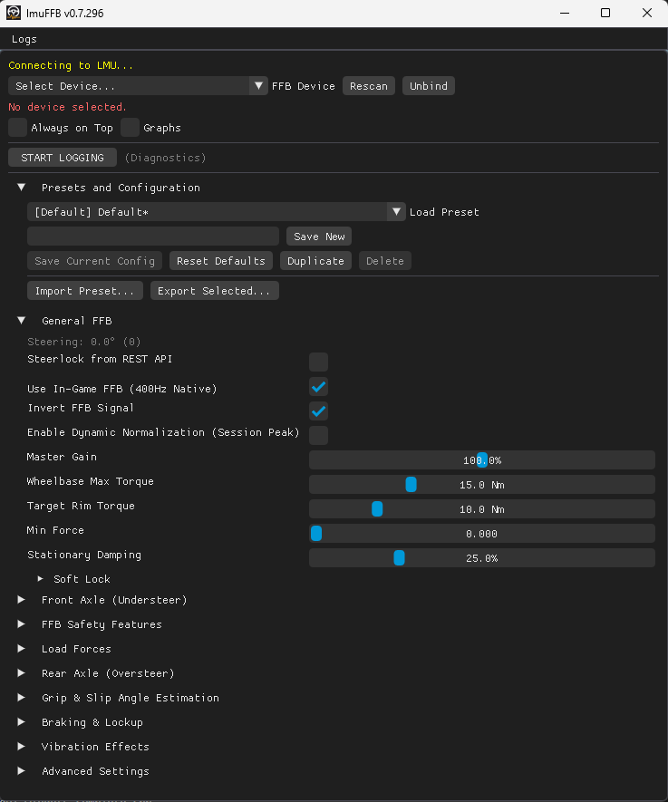

# lmuFFB

A Telemetry-based Force Feedback app for LMU, somewhat inspired by irFFB and Marvin's iRacing App.

Experimental alpha version.

## 📥 Download

*   **[Standard Releases (Recommended)](https://github.com/coasting-nc/LMUFFB/releases)**: Stable versions, released less frequently.

## Installation & Configuration (LMU 1.2+)

### Step-by-Step Setup

> [!IMPORTANT]
> **Folder Location**: To avoid write permission issues (unable to save settings or `config.ini` errors), **do NOT** place the lmuFFB folder in `C:\Program Files`. Instead, keep it in a location where the app has full write access, such as a subfolder in your **Downloads** folder.

**A. Configure Le Mans Ultimate (LMU)**
1.  Start LMU.
2.  Go to **Settings > Graphics**:
    *   Set **Display Mode** to **Borderless**. (Prevents crashes/minimizing).
3.  Go to **Controls > Force Feedback**.
4.  **Steering Axis**: Bind to your **Physical Wheel** (e.g., Simucube, Fanatec, Moza, Logitech).
5.  **In-Game Force Feedback settings in LMU**:
    *   Set in-game **Force Feedback Strength to 100%**. This ensures the app receives the full dynamic range of the signal. You can then manage the overall strength using the app's Master Gain.
    *   Ensure in-game Force Feedback is **Enabled**. It is necessary to have it enabled if you want to use the option to also transmit the in-game FFB through the lmuFFB app.

**B. Configure lmuFFB**
6.  Run `LMUFFB.exe`.
7.  **FFB Device**: In the dropdown, select your **Physical Wheel** (e.g., "Simucube 2 Pro", "Fanatec DD1").
8.  **Master Gain**: Start low (0.5) and increase.

9.  **Drive!** You should feel force feedback generated by the app.

## 🧪 Experimental Version - Testing Needed!

This is an **experimental release**, the FFB formulas may require refinement based on real-world testing.

**V0.7.40 Advanced Features:**
- **Dynamic Slope Detection**: Automatically detects tire saturation for more organic understeer feel.
- **Torque-based Anticipation**: Feels understeer earlier by monitoring pneumatic trail drop.
- **Curb Rejection Filter**: Prevents false understeer cues when hitting bumps or curbs.

**Please help us improve lmuFFB:**
1. **Test with caution** - Start with low wheel strength settings
2. **Experiment with settings** - Try different effect combinations and gains
3. **Share your results** - Post screenshots, thoughts and settings to the [LMU Forum Thread for the lmuFFB App](https://community.lemansultimate.com/index.php?threads/lmuffb-app.10440/)
4. **Report issues** - For bugs and technical issues, **it is much better to [open a GitHub issue](https://github.com/coasting-nc/LMUFFB/issues)** rather than posting on the forum. Issues on GitHub are periodically tackled by AI agents, while forum posts can be dispersive and difficult to track.

Your testing and feedback is greatly appreciated! 🙏

## Troubleshooting

-   **I am getting excessive oscillations while on straights**:
    -   Try setting "Smart Hands-off Protection" to 10% - 20% or more (it should work on GT3s, but might not for LMP2s and Hypercars).
    -   Increase at least to 1.0 the "Threshold" slider for "Yaw Kick" and "Power Yaw Kick" (if they are enabled).
-   **I am getting too much vibrations while braking**:
    -   Reduce "Lockup Strength" of the "Lockup Vibration" effect (e.g., down to 20%).
    -   Increase **Steering Shaft Smoothing** ("Front Grip" section) to 8 ms.
    -   Also adjust the other settings of the "Lockup Vibration" effect (you might need different settings per car class):
        -   **Gamma**: increase this to make the effect start weaker and more progressively.
        -   **Start slip**: increase this to delay the start of the effect, requiring more tire slip to trigger.
        -   **End slip**: increase this to make the effect reach its maximum strength later.
        -   **Sensitivity**: increase this to make the effect trigger later, requiring more wheel angular deceleration.
-   **Unable to save settings or config.ini errors**:
    - This usually happens if you placed the lmuFFB app or folder in a location without write permissions (e.g., inside `C:\Program Files`).
    - **Solution**: Keep the entire lmuFFB folder to a location where the app can have full write access, such as a subfolder in your **Downloads** folder.
-   **Inverted FFB (Force pushes away from center)**:
    -   If the FFB feels "backwards" or "inverted" while driving (wheel pushes away from center instead of pulling toward it), check the **"Invert FFB"** checkbox in the lmuFFB GUI.
    -   This reverses the force direction to match your wheel's expected behavior.
-   **No FFB**: 
    - Ensure the "FFB Device" in lmuFFB is your real wheel
    - Check if Connected to Le Mans Ultimate" appear in the GUI
    - Verify the FFB strength in your device driver is not too low
    - Increase Master Gain or reduce Max Torque Ref
    - Check the lmuFFB console for errors
-   **FFB too weak**:
    -   Increase **Master Gain** (slider ranges from 0% to 200%, so you can boost beyond 100%).
    -   Or reduce **Max Torque Ref** (this amplifies the signal by setting a lower reference point for maximum torque).
-   **Violent oscillations or shaking**:
    -   If you experience violent oscillations that the Smoothing or Speed Gate settings don't catch, try **increasing Max Torque Ref** (e.g., from 45 to 60-80 Nm).
    -   Higher Max Torque Ref values reduce clipping and noise, which can cause oscillations.
    -   **Tuning Tip**: Max Torque Ref is the primary way to control the balance between clipping/noise and steering weight. Start at 45 Nm and adjust based on your preference.
-   **Strange pull in some scenarios**:
    -   If you feel a strange pull in specific driving situations, try reducing the **Rear Align Torque**.
- **Sharing Presets**:
    -   You can now easily share your FFB settings with others using the **"Export Selected..."** and **"Import Preset..."** buttons in the Presets section.
    -   Exported presets are saved as small `.ini` files that can be sent to other users.
-   **The app has too many options and it's confusing**:
    -   A future version will include a **"Basic Mode"** with auto adjustment and defaults for most settings.
    -   We need to first determine which settings work best for most users and wheel types (Direct Drive vs Belt/Gear).
    -   **Please leave feedback** on the forum thread telling us what settings work best for you: [LMU Forum Thread](https://community.lemansultimate.com/index.php?threads/lmuffb-app.10440/)
-   **Any other issue**:
    -   **Preferred**: [Open a GitHub Issue](https://github.com/coasting-nc/LMUFFB/issues). This is the best way to ensure your issue is tracked and addressed. Our AI agents periodically scan and attempt to fix GitHub issues.
    -   Alternatively, post in the [LMU Forum Thread](https://community.lemansultimate.com/index.php?threads/lmuffb-app.10440/), but be aware that forum posts are harder to track.

## Clarification about the Interaction Between In-Game FFB (from LMU) and the FFB from the App

The app takes **exclusive control** of the FFB sent to your wheelbase, which means that it is the only program sending force feedback to your wheelbase. This is required by DirectInput, and it is the reason why the app displays "Game FFB is blocked."

However, among the many telemetry channels that the App uses, lmuFFB includes a specific telemetry channel called **"In-Game FFB"**, which allows you to still include the LMU original FFB signal within the final FFB that the app produces.

### How it Works

The "In-Game FFB" stream is the FFB produced by LMU. It is mostly based on the Steering Rack Torque (which is why in the app you can select it as one of the two possible steering torque sources), plus any additional effect and processing that LMU might be doing on it behind the scenes (eg. adding damping, smoothing, vibrotactile effects, etc.).

This stream is impacted by any setting that you might change from the game FFB Settings (see below).

You can control the impact of the In-Game FFB on the final FFB produced by lmuFFB in several ways:

*   You can enable or disabled it: by selecting "In-Game FFB" as your **Steer Torque Source** in the app, it will be combined with all other telemetry-based forces processed by lmuFFB to produce the final FFB you feel.
*   **Game Settings**: Any changes you make to LMU's internal FFB settings (strength, smoothing, vibrotactile effects, etc.) should directly affect what lmuFFB receives through this channel.
*   In App **Gain** slider: The **"In-Game FFB Gain"** slider in lmuFFB acts as an additional multiplier to change the strenght of this specific channel.

### In-Game FFB (400Hz) vs. Shaft Torque (100Hz Legacy)

In the App (**"Front Grip" section**), you have two options for your base steering torque ("Steer Torque Source"):

1.  **In-Game FFB**:
    *   **Pros**: High sample rate (400Hz), includes LMU's built-in processing (eg. smoothing) and specialized effects (eg. vibrotactile effects).
    *   **Cons**: if you don't like the game built-in processing.

2.  **Shaft Torque (100Hz Legacy)**:
    *   **Pros**: A "pure" source of steering rack torque information without game-side processing.
    *   **Cons**: Lower sample rate (100Hz), potentially slightly higher latency (though usually unnoticeable), and may require gain adjustments via the **"Steering Shaft Gain"** slider, because it might have a very different baseline strength compared to In-Game FFB.

## FAQ

**Q: Does the app constitute an unfair advantage ("cheating")?**

**A:** No. Multiple wheelbase manufacturers already provide or are implementing telemetry-based force feedback (including VNM, Simucube, and Simagic). By the same logic, those would constitute an "unfair advantage" too.

Additionally, bassshakers/transducers, active pedals, motion platforms, and other simracing equipment also give similar additional telemetry-based information (tire lockup, wheelspin, car behavior, etc.), and are not considered an unfair advantage either.

The app allows everybody to have the option of having additional telemetry-based feedback information, not just the owners of expensive equipment or particular wheelbases.

**Q: Does the app have an option to remove the feeling of flatspots vibrations from FFB? Is that an unfair advantage?**

**A:** No. The app had a "Notch Filter" option that is also present in Simucube wheelbase software (and possibly other wheelbases), so that is a legitimate feature. The feature was supposed to reduce specific user-defined frequencies from the FFB signal, like in the Simucube software. It was improperly named "Flatspot Suppression", but it could attenuate any frequency, like in other wheelbase software. Early testing suggested it was not actually doing anything (it wasn't working). The feature has in any case been removed in recent versions of the app, since it was a legacy effect that was not working and was not really necessary for the app.

**Q: How is the app getting the telemetry data from the game?**

**A:** The app is using the official LMU Shared Memory Interface that was introduced with LMU 1.2 in December 2025.

## Upcoming Features

* Basic mode with only main sliders and auto adjustments of more advanced settings
* Wet Weather Haptics (Hydro-Grain): vibration cues telling when the tires are on dry or wet surface, and if there is grip or not. This tries to replicate some the particular wet track grip and dynamics that can be felt in real life cars.
* Support for other Sims (AC Evo, RaceRoom, AC, ACC, rF2).
  
## Feedback & Support

For feedback, questions, or support:
*   **GitHub Issues (Recommended for Bugs)**: [Report bugs or request features](https://github.com/coasting-nc/LMUFFB/issues). GitHub issues are easier for us to track and are periodically tackled by AI development agents.
*   **LMU Forum Thread**: [lmuFFB App](https://community.lemansultimate.com/index.php?threads/lmuffb-app.10440/). Best for general discussion and sharing settings.

## Documentation

Note: this documentation is not up to date.

*   [FFB Tuning Recommendations](docs/user_guides/FFB%20Tuning%20Recommendations.md) 
*   [Driver's Guide to Testing LMUFFB](docs/user_guides/Driver's%20Guide%20to%20Testing%20LMUFFB.md) - Suggestions for specific driving scenarios and car setups to test each FFB effect 
*   [The Physics of Feel - Driver's Guide](docs/user_guides/the_physics_of__feel_-_driver_guide.md) - Explains how lmuFFB translates telemetry into tactile sensations, with telemetry visualizations
*   [FFB Effects & Customization Guide](docs/user_guides/ffb_effects.md)

##  Videos and Reviews

UKOG: [This FFB App is Blowing Up… But is it Actually Better? (Le Mans Ultimate)](https://www.youtube.com/watch?v=4OVys-06StM)

Gamer Muscle: [This FFB App Completely Transforms LMU – Full Setup, Profiles & Download](https://www.youtube.com/watch?v=CQJRmhMaoPU)

For lmuFFB profiles checkout:
* UKOG discord, which has a section with user profiles and discussions for specific wheelbases: https://discord.gg/ukog
* Gamer Muscle Patreon (free): from which you can download GM profiles for GT3s, LMP2, Hypercars, and a specific profile for lower Nm wheelbases (4 Nm): https://www.patreon.com/posts/lmuffb-app-gamer-155277185
