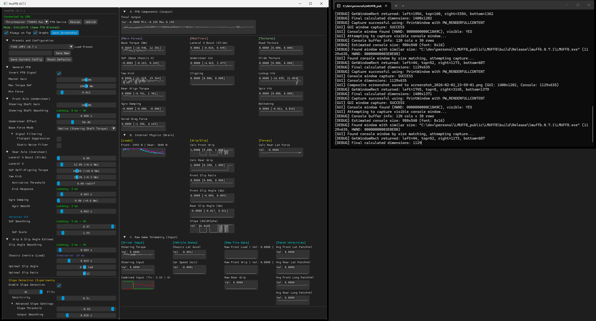

# Implement Slope Detection logic to estimate grip loss (understeer, oversteer) independently from a fixed optimal slip angle

**Issue #25**
**Source:** https://github.com/coasting-nc/LMUFFB/issues/25

## Description

See:
*   [FFB Slope Detection for Grip Estimation](../dev_docs/FFB%20Slope%20Detection%20for%20Grip%20Estimation.md)
*   [FFB Slope Detection for Grip Estimation2](../dev_docs/FFB%20Slope%20Detection%20for%20Grip%20Estimation2.md)
*   [slope_detection_implementation_plan](../dev_docs/slope_detection_implementation_plan.md)
*   [slope_detection_implementation_plan2](../dev_docs/slope_detection_implementation_plan2.md)

Update: an initial, experimental version of this feature was implemented with version 0.7.0.

## Comments

### coasting-nc commented 8 hours ago

User feedback:
"I've just tried the new version with the Slope Detection. Suddenly my wheel was very heavy and notchy. I turned down the gain but it was still bad. (I was still using Aaron's presets though). I turned the slope detection off and things were back to how I raced with it." https://community.lemansultimate.com/index.php?threads/lmuffb-app.10440/post-80486
"I also just tried dynamic Slope Detection. Same for me, very heavy and notchy. In corners it fells like a strong low frequency rumble. When lowering understeer effect strength it gets less pronounced, and the notchy rumble is gone at 0% understeer effect." https://community.lemansultimate.com/index.php?threads/lmuffb-app.10440/post-80498
"At first I was also unable to find success with Slope Detection. I was getting huge oscillations both in corners and on the straights. I tried max filter, min filter, max smoothing, min sensitivity, lowest threshold and many combinations of it all. Nothing helped. But then I tried lowering and shutting off Lateral G Boost Slide and viola! This is lovely! Previously I found that the Optimal Slip settings were important and Slope Detection is even better and now dynamic. " https://community.lemansultimate.com/index.php?threads/lmuffb-app.10440/post-80513
"I played with those settings, didn't help much. For a test I put in the pit speed limiter (60 kph) and watched the "grip" indicator under "advanced slop settings", it fluctuated between 20% and 100% when driving zig zag lines and I get strong hits in the ffb. Is this correct that the grip goes down to 20% at 60 kph? In general the ffb feels very notchy, with lots of strong hits when turning the wheel with dynamic Slope Detection when the understeer effect is over 30%. When I disable the dynamic Slope Detection the ffb is very smooth (with my settings) and I have the understeer effect at 70%." https://community.lemansultimate.com/index.php?threads/lmuffb-app.10440/post-80529

### coasting-nc commented 8 hours ago

TODO Fixes:
*   add display of latency amount depending on the filter window size
*   the UI display seems incorrect for "Filter Window" slider (text on the right, slider on the left).
*   Missing tooltip on "Filter Window" slider
*   Missing tooltip on checkbox to activate Slope Detection (should be a general description of the algorithm and this section of settings)
*   Verify that the graphs include a graph that shows the grip estimated with the slope detection (either a new graph or in the current grip graph).
*   Tweak the default settings of these sliders depending on user feedback
*   Convert the " Live Slope" next to the slider into a proper graph in the graphs section
*   Investigate why disabling Lateral G Boost might let Slop Detection and Understeer Effect work properly.
*   Investigate why the "grip" indicator under "advanced slop settings" fluctuates between 20% and 100% when driving zig zag lines at just 60 kph, and the FFB gives strong hits. Grip should not go as low as 20% at 60 kph.

### coasting-nc commented in 21 minutes

See https://github.com/coasting-nc/LMUFFB/releases/tag/v0.7.1 which fixes some of the issues.

### coasting-nc commented in 25 minutes

TODO Fixes:
*   Texts of some widgets in Slope Detection are too long and get truncated. Solution: shorten them and use a tool tip over the text itself for additional text.
*   The latency for Filter Windo should be displayed above the slider bar, like for other widgets with latency
*   The slider bar should be on the right column, and the name of the setting on the left column.

### coasting-nc commented in 30 minutes

v0.7.1, Slope Detection not working as intended. Looking at the graphs dG/dAlpha seems to oscillate from max to min, with no intermediate values. This is despite having Filter Window maxed out (41), and sensitivity down to 0.5x.

### coasting-nc commented in 35 minutes

More feedback from users on this effect not working:

*   "I enable Slope detection and turn understeer effect back up to 50% and it still just reduces overall force by that amount, at ALL times. There is simple no understeer effect present. Please tell me where to start in the GT3s, VRS 20NM BTW. Also above ~70% understeer effect, there is a weird noisy feel in my FFB"
    "reducing the sensitivity to 0.1x eliminated the artifacts I had, but no matter what I set the other settings to, there is absolutely no understeer effect happening. I tested it by driving in a circle. I will just turn everything related off and live with that. Feels the best that way. It somehow feels like the understeer effect is constantly running at 100% understeer. Thats why my FFB nearly disappears completely when putting the effect to 100% reduction, even on straights"

*   "tested out the new version just with the Merc GT3 at Spa. Mainly as I've struggled to get a decent GT3 setting. I've just loaded up my GT3 setting, added the new understeer effect and it felt better immediately. The only tweaks I've made are lowering overall strength as it seems to add more resistance off the bat (makes sense) and upped slope detection sensitivity from default to 1.0x." https://community.lemansultimate.com/index.php?threads/lmuffb-app.10440/page-18

*   "Tested on the Mclaren and it just doesn't work (slope detection). Pulling the wheel all over the place, so can't recommend the above settings anymore."

*   "Yes, the FFB for the Mclaren feels very notchy with strong jolts that make no sense. I have to reduce FEI in my Fanatec settings to 10 to reduce those to an acceptable level."

*   "Just as a further update, I think the new slope effect is great overall, it’s been fine in the Merc, Porsche and Lexus so far. Just seems to be a weird issue with the McLaren while using it." "I’ve tried it (slope) on the LMP2 and prefer it off for that (note to everyone - ELMS LMP2 at Qatar with this app - utterly fantastic). Feels better on with the GT3’s so far for me."

