# The Physics of Feel: LMUFFB Driver's Guide

This guide explains how LMUFFB translates raw telemetry data into tactile sensations. It details what you should feel in specific driving situations and provides a blueprint for visualizing these relationships through telemetry graphs.

## Part 1: Individual Driving Phenomena

### 1. Understeer (Front Grip Loss)

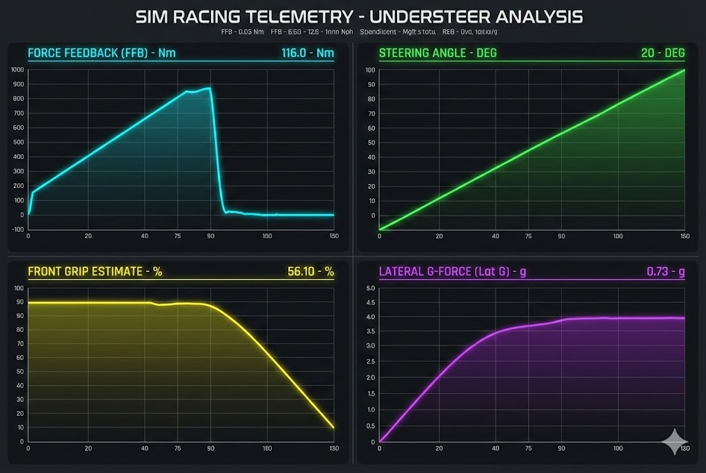

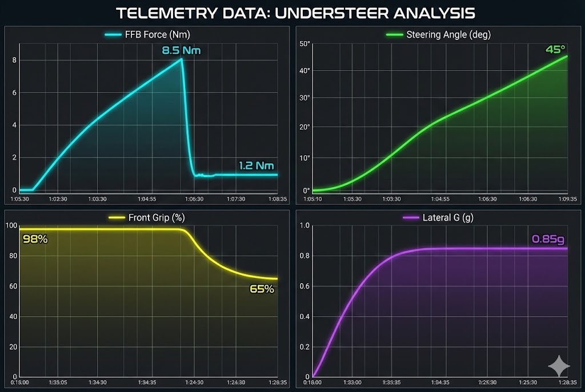

**The Situation:** You turn the wheel, but the car continues straight. The front tires have exceeded their slip angle limit and are scrubbing across the asphalt.

**The FFB Sensation:**
As you turn the wheel further, instead of the resistance increasing (as it would with a spring), the wheel suddenly goes **light**. The weight falls out of the steering, signaling that adding more steering angle is futile.

**How it Works:**
LMUFFB monitors the `GripFraction` of the front tires. As this value drops below 1.0 (100%), the application reduces the global steering force.

 

---

### 2. Oversteer (Rear Grip Loss / SoP)

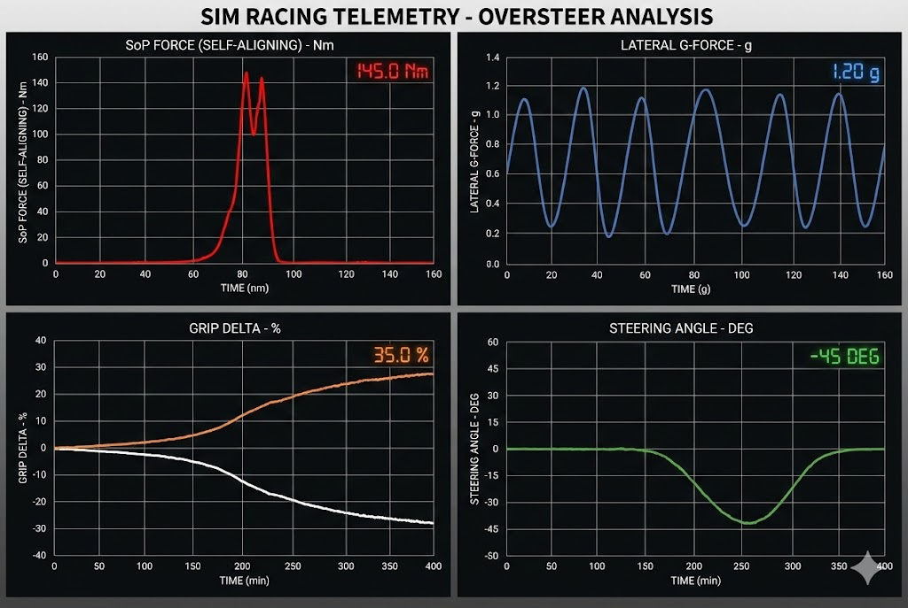

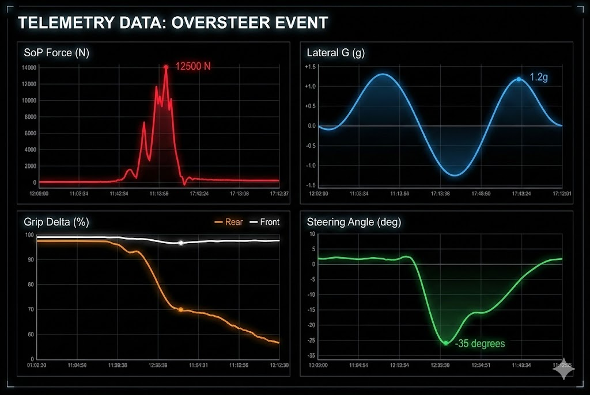

**The Situation:** The rear tires lose grip, and the back of the car rotates (yaws) faster than the front. The car is sliding sideways.

**The FFB Sensation:**
You feel a distinct **pull** in the direction of the slide, urging you to counter-steer. Simultaneously, you feel the "weight" of the car shifting sideways through the rim, giving you an early warning before your eyes even detect the rotation.

**How it Works:**
This is the "Seat of Pants" (SoP) effect. LMUFFB injects Lateral G-force (`mLocalAccel.x`) into the steering signal. Additionally, it calculates a synthetic "Aligning Torque" based on the rear axle's lateral forces, boosting the signal when the rear grip drops below the front grip.

 

---

### 3. Braking Lockup (Threshold Braking)

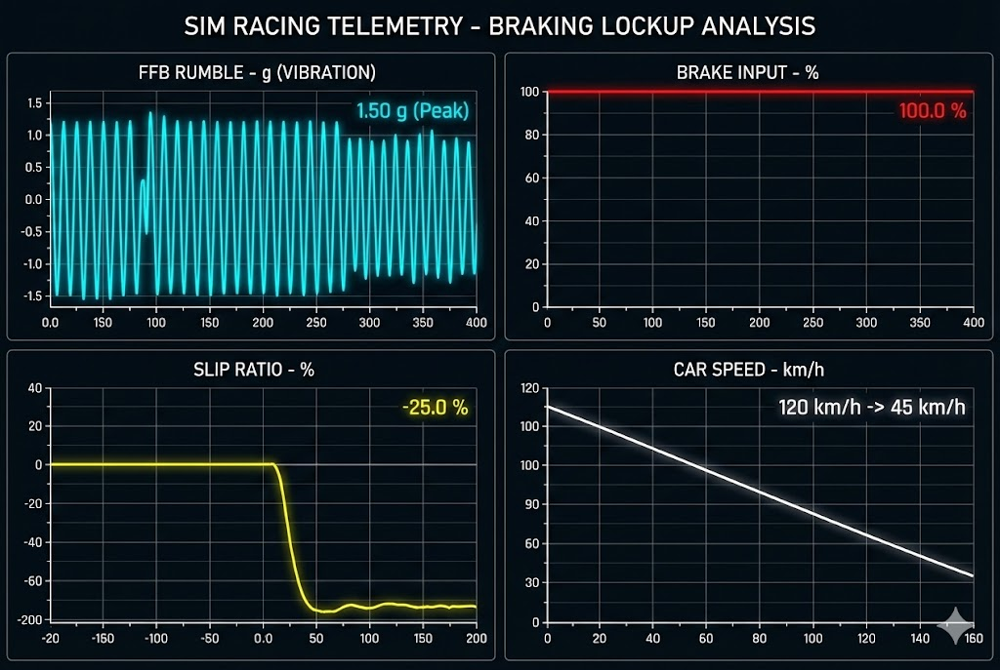

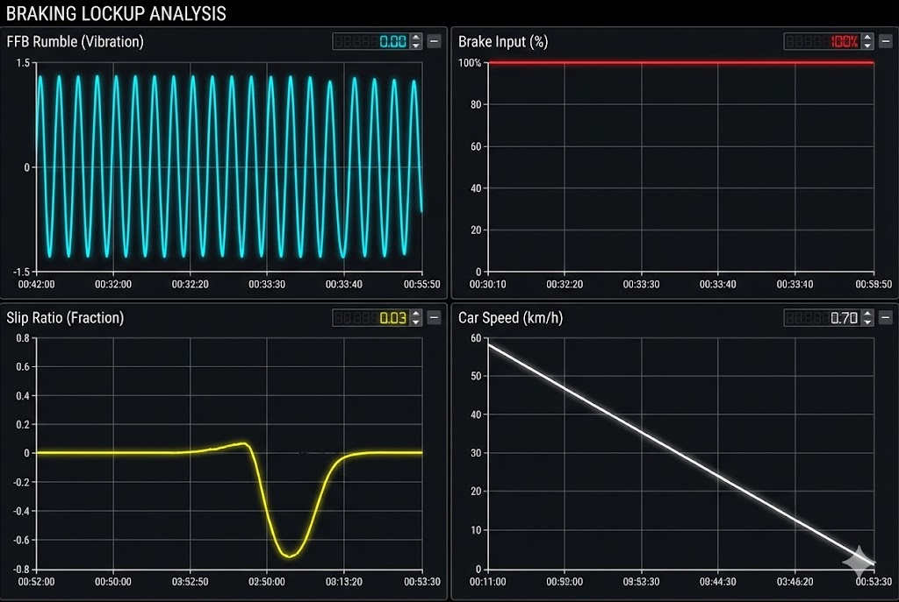

**The Situation:** You stomp on the brakes. One or more tires stop rotating while the car is still moving. The rubber is dragging along the road surface.

**The FFB Sensation:**
You feel a **vibration** that changes pitch based on your speed.
*   **High Speed:** A high-frequency "screeching" buzz (approx 60-80Hz).
*   **Low Speed:** A low-frequency "judder" or "grinding" (approx 10-20Hz).
*   *Note:* The vibration is stronger when the tire is heavily loaded (downforce/weight transfer) and fades if the tire is unloaded.

**How it Works:**
LMUFFB detects when `SlipRatio` is less than -0.1. It generates a sine wave where the **Frequency** is linked to Car Speed (`mLocalVel.z`) and the **Amplitude** is linked to Vertical Tire Load (`mTireLoad`).

 

---

### 4. Traction Loss (Power Wheel Spin)

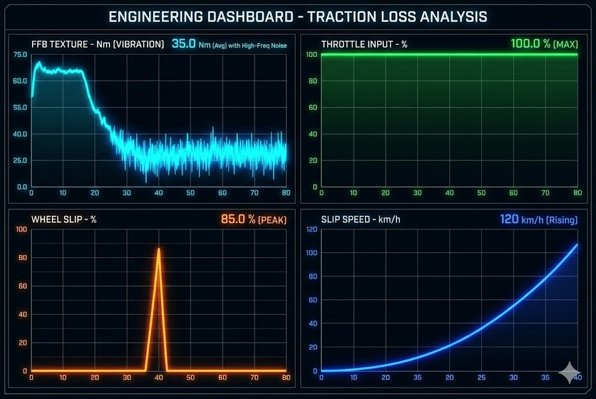 0.2. Plot D (Physics): Slip Speed (m/s) correlating with vibration pitch." width="50%">

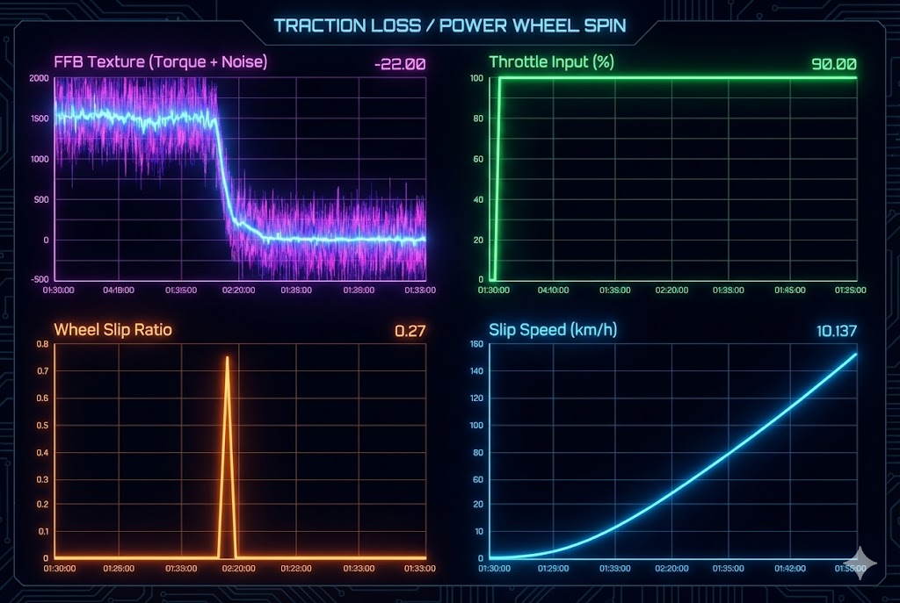

**The Situation:** You apply full throttle in a low gear. The rear tires break traction and spin significantly faster than the road speed.

**The FFB Sensation:**
The steering wheel feels **vague and floating**, as if the rear of the car has detached from the road. Overlaid on this lightness is a smooth, high-frequency **hum** that rises in pitch as the wheels spin up.

**How it Works:**
LMUFFB detects positive `SlipRatio`.
1.  **Torque Drop:** It multiplies the total force by a reduction factor (e.g., 0.6x), creating the "floating" sensation.
2.  **Vibration:** It generates a vibration based on **Slip Speed** (the difference in m/s between tire surface and road).

 

---

### 5. Slide Texture (Lateral Scrubbing)

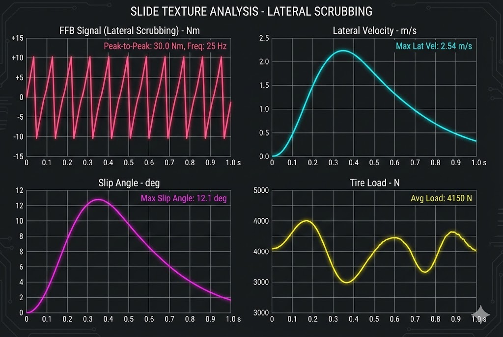

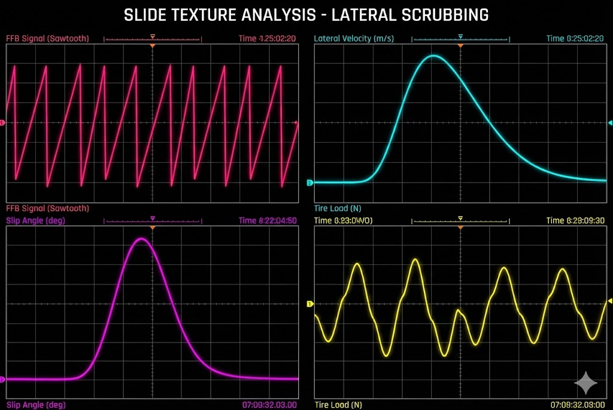

**The Situation:** You are cornering hard. The car isn't spinning, but the tires are operating at a high slip angle, "crabbing" or scrubbing sideways across the asphalt.

**The FFB Sensation:**
A granular, **sandpaper-like texture** through the rim. It feels like the tire is "tearing" at the road surface.

**How it Works:**
When `LateralPatchVel` (the speed at which the contact patch slides sideways) is high, LMUFFB injects a **Sawtooth** wave. The sawtooth shape mimics the "stick-slip" physics of rubber friction better than a smooth sine wave.

 

---

## Part 2: Complex Interactions & Dynamics

This section details how LMUFFB handles conflicting signals to create a cohesive, natural driving feel.

### 1. The Power Slide (Spin vs. SoP)

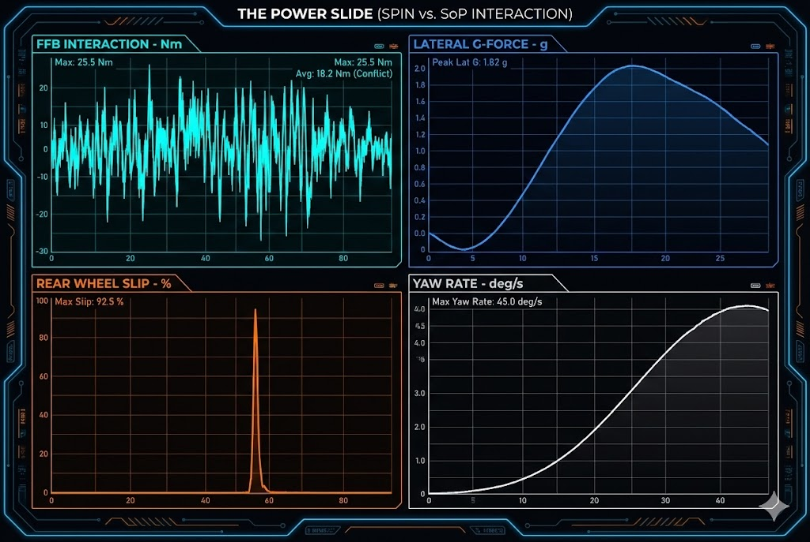

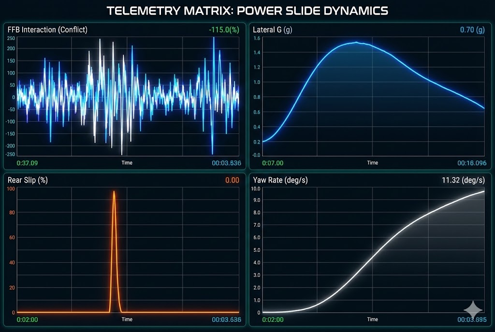

**The Scenario:** Exiting a corner, you mash the throttle. The rear end steps out violently (Oversteer), but the wheels are also spinning wildly (Traction Loss).

**The Interaction:**
*   **The Conflict:**
    *   **SoP Effect** wants to *increase* force to tell you the car is rotating and urge a counter-steer.
    *   **Spin Effect** wants to *decrease* force to simulate the loss of rear friction and the "floating" rear axle.
*   **The Result:** A **"Light Counter-Steer"**. The wheel pulls in the direction of the correction (SoP), but the resistance is lower than normal (Spin Drop).
*   **Why it feels natural:** This mimics reality. When rear tires are spinning, they have very little lateral grip. The steering should guide you into the slide, but it shouldn't feel heavy or "locked in" because the rear of the car is effectively floating on a layer of molten rubber.

 

---

### 2. The "Dive" (Load Transfer vs. Understeer)

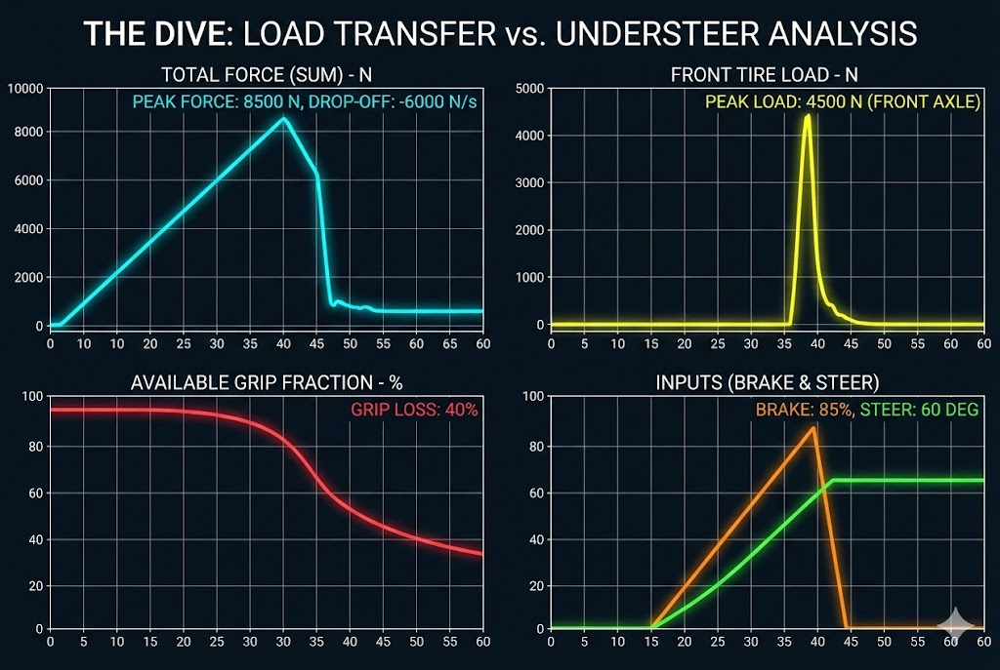

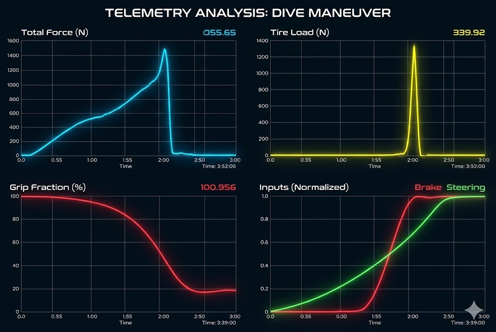

**The Scenario:** You brake hard while turning into a corner (Trail Braking). The weight of the car transfers to the front tires.

**The Interaction:**
*   **The Conflict:**
    *   **Load Sensitivity** sees massive weight on the front tires (3000N -> 6000N). This *increases* the amplitude of road textures and mechanical trail.
    *   **Understeer Effect** watches the grip limit. If you brake too hard, you exceed the grip circle, and the effect tries to *reduce* force.
*   **The Result:** **"Heavy to Light Transition"**. Initially, the wheel feels incredibly heavy and detailed (due to Load Sensitivity) as the nose dives. As you exceed the limit, the weight suddenly vanishes (Understeer Effect), giving you a clear tactile cliff edge: "You pushed too hard."

 

---

### 3. The "Tank Slapper" (Snap Oversteer Recovery)

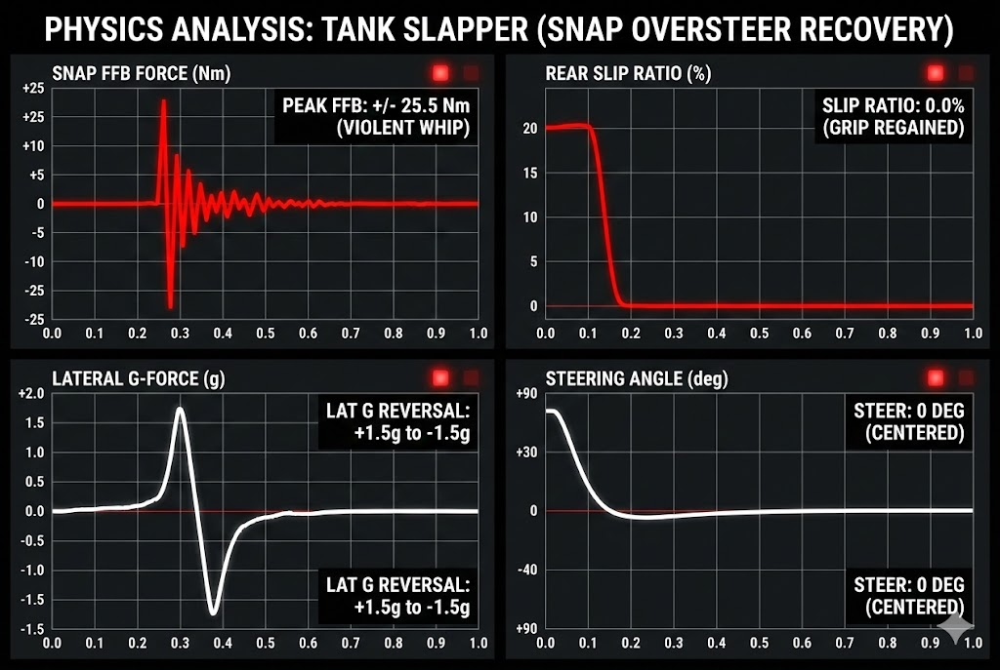

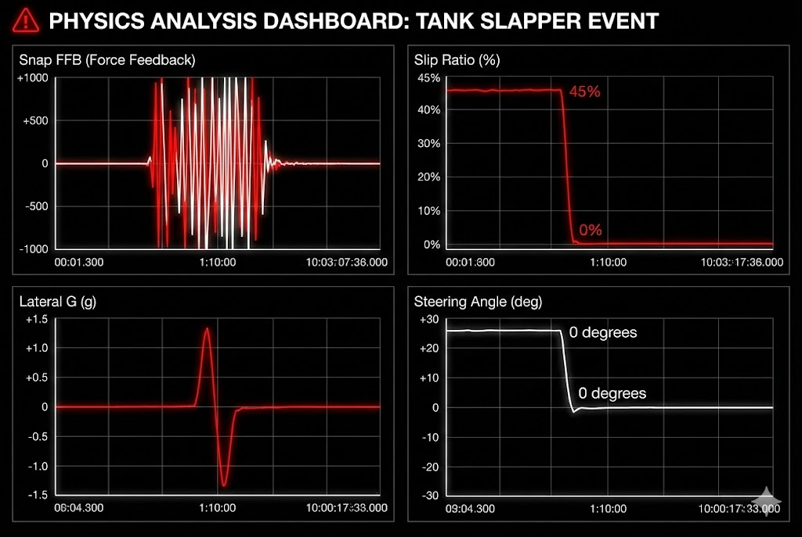

**The Scenario:** You are counter-steering to catch a slide. Suddenly, the rear tires regain grip.

**The Interaction:**
*   **The Sequence:**
    1.  **Slide Phase:** SoP is high (pushing wheel correction), Spin Drop might be active.
    2.  **Grip Regain:** Rear Slip Ratio drops to 0. Lateral G snaps the other way.
*   **The Result:** **"The Snap"**.
    *   The "Spin Torque Drop" vanishes instantly (Force returns to 100%).
    *   The SoP vector reverses direction violently as the car snaps back.
    *   The FFB delivers a high-torque "whip" motion, simulating the stored energy in the chassis releasing. This cues the driver to center the wheel immediately to avoid over-correcting into a wall.

 